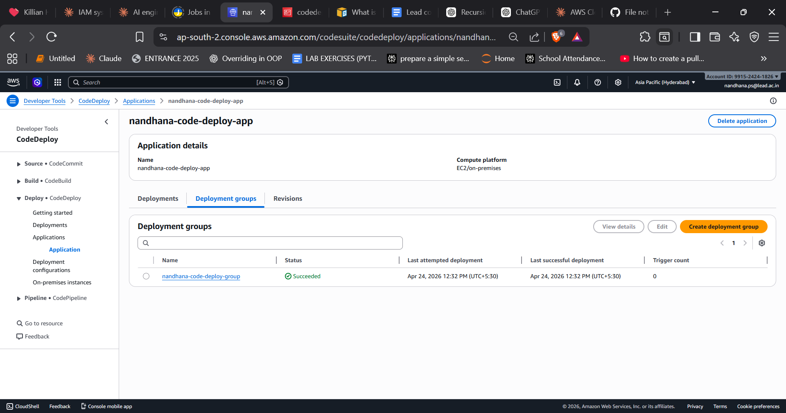
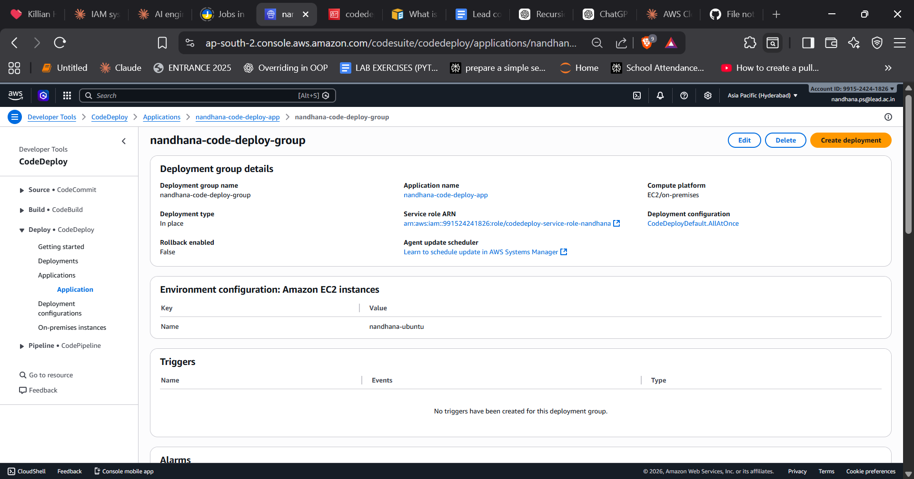
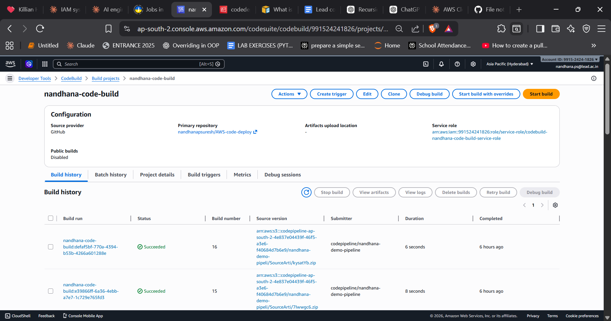
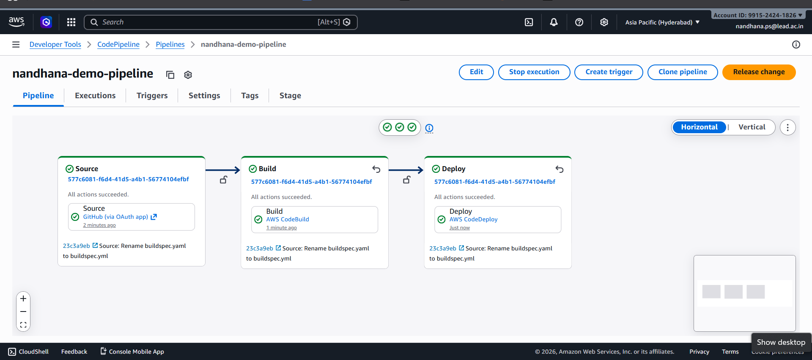
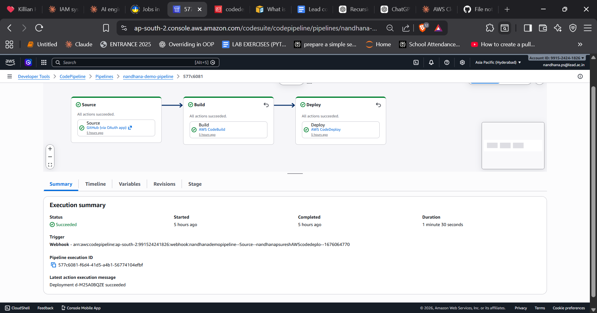

# AWS CodePipeline + CodeBuild + CodeDeploy + EC2

## Overview
This project demonstrates a complete CI/CD pipeline on AWS that automatically
deploys a web application to an EC2 Ubuntu instance running Apache whenever
code is pushed to GitHub.

---

## Architecture

GitHub → CodePipeline → CodeBuild → CodeDeploy → EC2 (Ubuntu + Apache)

---

## Services Used

| Service | Purpose |
|---------|---------|
| GitHub | Source code repository |
| AWS CodePipeline | Orchestrates the full CI/CD workflow |
| AWS CodeBuild | Builds and packages the artifact |
| AWS CodeDeploy | Deploys the artifact to EC2 |
| AWS EC2 (Ubuntu) | Hosts Apache web server |
| AWS IAM | Manages roles and permissions |
| AWS S3 | Stores build artifacts between stages |

---

## Repository Structure

AWS-code-deploy/
├── appspec.yml       # CodeDeploy deployment instructions
├── buildspec.yml     # CodeBuild build instructions
├── index.html        # Web application file
└── README.md

---

## Step 1: Launch EC2 Instance

1. Go to **EC2 → Launch Instance**
   - Name: `apache-server`
   - AMI: Ubuntu Server
   - Instance type: `t2.micro`
   - Security group: Allow SSH (22) and HTTP (80)

2. SSH into the instance:
```bash
ssh -i "your-key.pem" ubuntu@<public-ip>
```

3. Install Apache:
```bash
sudo apt update -y
sudo apt install apache2 -y
sudo systemctl start apache2
sudo systemctl enable apache2
```

---

## Step 2: Install CodeDeploy Agent on EC2

```bash
sudo apt update -y
sudo apt install ruby-full wget -y
cd /home/ubuntu
wget https://aws-codedeploy-ap-south-2.s3.ap-south-2.amazonaws.com/latest/install
chmod +x install
sudo ./install auto
sudo systemctl start codedeploy-agent
sudo systemctl enable codedeploy-agent
```

---

## Step 3: IAM Roles — CRITICAL SECTION

> ⚠️ Most deployment failures happen here. Read carefully.

### Two completely separate roles are required:

---

### Role 1 — EC2 Instance Role
This role is **attached to the EC2 instance** so the CodeDeploy agent
can communicate with AWS services.

| Field | Value |
|-------|-------|
| Role Name | `ec2-codedeploy-access-nandhana` |
| Trusted by | `ec2.amazonaws.com` |
| Policies | `AmazonEC2RoleforAWSCodeDeploy`, `AmazonS3ReadOnlyAccess` |
| Where to use | Attach to EC2 → Actions → Security → Modify IAM Role |

**Trust Policy (must be exactly this):**
```json
{
  "Version": "2012-10-17",
  "Statement": [
    {
      "Effect": "Allow",
      "Principal": {
        "Service": "ec2.amazonaws.com"
      },
      "Action": "sts:AssumeRole"
    }
  ]
}
```

---

### Role 2 — CodeDeploy Service Role
This role is **used by the CodeDeploy Deployment Group** to manage deployments.

| Field | Value |
|-------|-------|
| Role Name | `codedeploy-service-role-nandhana` |
| Trusted by | `codedeploy.amazonaws.com` |
| Policies | `AWSCodeDeployRole` (auto-attached when selecting CodeDeploy use case) |
| Where to use | CodeDeploy → Deployment Group → Service Role field |

**Trust Policy (must be exactly this):**
```json
{
  "Version": "2012-10-17",
  "Statement": [
    {
      "Effect": "Allow",
      "Principal": {
        "Service": "codedeploy.amazonaws.com"
      },
      "Action": "sts:AssumeRole"
    }
  ]
}
```

> ✅ Easiest way to create this correctly: IAM → Create Role →
> AWS Service → Use case: **CodeDeploy** → it sets the trust policy automatically.

---

### Role 3 — CodePipeline Service Role
Auto-created by CodePipeline but **missing CodeDeploy permissions by default**.

After pipeline is created, go to:
**IAM → Roles → AWSCodePipelineServiceRole-ap-south-2-\<pipeline-name\>**

Add this inline policy:
```json
{
  "Version": "2012-10-17",
  "Statement": [
    {
      "Effect": "Allow",
      "Action": "codedeploy:*",
      "Resource": "*"
    }
  ]
}
```

---

## Step 4: Attach IAM Role to EC2 — CRITICAL

After creating Role 1, you must attach it to your EC2 instance.

**From AWS Console:**
1. Go to **EC2 → your instance**
2. Click **Actions → Security → Modify IAM Role**
3. Select `ec2-codedeploy-access-nandhana`
4. Click **Update IAM Role**

**Verify it is attached — run this on EC2:**
```bash
curl http://169.254.169.254/latest/meta-data/iam/info
```

Expected response:
```json
{
  "Code": "Success",
  "InstanceProfileArn": "arn:aws:iam::XXXXXXXXXXXX:instance-profile/ec2-codedeploy-access-nandhana"
}
```

> ⚠️ If this returns empty — the role is NOT attached.
> The CodeDeploy agent will fail with "Missing credentials" error.

**If role attachment fails from console (stuck association), use AWS CLI:**
```bash
# Step 1 — Find existing association
aws ec2 describe-iam-instance-profile-associations \
  --filters Name=instance-id,Values=<your-instance-id>

# Step 2 — Remove stuck association
aws ec2 disassociate-iam-instance-profile \
  --association-id <association-id-from-above>

# Step 3 — Attach correct role
aws ec2 associate-iam-instance-profile \
  --instance-id <your-instance-id> \
  --iam-instance-profile Name=ec2-codedeploy-access-nandhana
```

---

## Step 5: Create CodeDeploy Application

1. Go to **CodeDeploy → Create Application**
   - Name: `nandhana-code-deploy-app`
2. Create Deployment Group
   - Name: `nandhana-code-deploy-group`
   - Service role: `codedeploy-service-role-nandhana` ← must be Role 2, NOT Role 1
   - EC2 Tag: `Key=Name, Value=apache-server`


### CodeDeploy Application


### Deployment Group Configuration


---

## Step 6: Create CodeBuild Project

1. Go to **CodeBuild → Create Project**
   - Name: `nandhana-demo-build`
   - Source: GitHub
   - Environment: Managed image, Ubuntu
   - Buildspec: Use `buildspec.yml` from source


### CodeBuild — Successful Build

---

## Step 7: Create CodePipeline

1. Go to **CodePipeline → Create Pipeline**
   - Name: `nandhana-demo-pipeline`
2. Source: GitHub → select this repo, branch `main`
3. Build: CodeBuild → `nandhana-demo-build`
4. Deploy: CodeDeploy → `nandhana-code-deploy-app` → `nandhana-code-deploy-group`

### CodePipeline — All Stages


---

## Verification

After pipeline runs successfully:
```bash
# On EC2 — check deployed files
ls /var/www/html

# Verify Apache is serving
curl http://localhost
```

Open in browser: `http://<ec2-public-ip>`

### Pipeline Execution Summary


---

## ⚠️ AWS Errors Encountered & Fixes

---

### Error 1 — CodeDeploy Cannot Assume the Role

AWS CodeDeploy does not have the permissions required to assume the role
arn:aws:iam::XXXXXXXXXXXX:role/ec2-codedeploy-access-nandhana

**Why it happens:**
The EC2 instance role was assigned as the CodeDeploy service role in the
Deployment Group. These are two different roles with different trust policies.
The EC2 role trusts `ec2.amazonaws.com` — CodeDeploy cannot assume it.

**Fix:**
Create a **separate** CodeDeploy service role that trusts `codedeploy.amazonaws.com`
and assign that to the Deployment Group instead.

> Never use the same role for both EC2 instance profile and CodeDeploy service role.

---

### Error 2 — CodePipeline Not Authorized for CodeDeploy Actions

User: arn:aws:sts::XXXXXXXXXXXX:assumed-role/AWSCodePipelineServiceRole...
is not authorized to perform: codedeploy:GetApplicationRevision

**Why it happens:**
CodePipeline's auto-created service role does not include CodeDeploy permissions
by default. The inline policy may also have been saved with empty
`Action: []` and `Resource: []` arrays — which allows nothing.

**Fix:**
Go to **IAM → Roles → AWSCodePipelineServiceRole-\<your-pipeline\>**
and add inline policy with `"Action": "codedeploy:*"` and `"Resource": "*"`.

> Always verify the inline policy was saved correctly —
> open it and confirm Action and Resource are not empty arrays.

---

### Error 3 — Missing Credentials on EC2 (CodeDeploy Agent Fails)

ERROR: Missing credentials - please check if this instance was
started with an IAM instance profile

**Why it happens:**
The EC2 instance has no IAM role attached. The CodeDeploy agent running
on EC2 has no credentials to communicate with AWS services.

**Diagnose:**
```bash
sudo tail -20 /var/log/aws/codedeploy-agent/codedeploy-agent.log
```

**Fix:**
Attach the EC2 IAM role via **EC2 → Actions → Security → Modify IAM Role**,
then restart the agent:
```bash
sudo service codedeploy-agent restart
```

Verify fix:
```bash
curl http://169.254.169.254/latest/meta-data/iam/info
# Must return "Code": "Success"
```

---

### Error 4 — Stuck IAM Instance Profile Association

Failed to replace instance profile
The association iip-assoc-XXXXXXXXXX is not the active association

**Why it happens:**
A previous IAM role association is stuck in `disassociating` state.
The console cannot overwrite it. This also happens when commands are
accidentally run against the wrong EC2 instance ID.

**Fix:**
Use AWS CLI to force-remove and re-attach:
```bash
# Find stuck association
aws ec2 describe-iam-instance-profile-associations \
  --filters Name=instance-id,Values=<your-instance-id>

# Remove it
aws ec2 disassociate-iam-instance-profile \
  --association-id <association-id>

# Re-attach correct role
aws ec2 associate-iam-instance-profile \
  --instance-id <your-instance-id> \
  --iam-instance-profile Name=ec2-codedeploy-access-nandhana
```

> Always verify your instance ID before running CLI commands.
> Check EC2 console — the instance ID is shown in the details panel.

---

### Error 5 — HEALTH_CONSTRAINTS Deployment Failure

The overall deployment failed because too many individual instances
failed deployment, too few healthy instances are available

**Why it happens:**
This is a generic wrapper error. The real cause is always in the
deployment lifecycle event logs. Common underlying causes:

| Underlying Cause | How to Identify |
|-----------------|----------------|
| No IAM role on EC2 | Agent log shows "Missing credentials" |
| appspec.yml missing | Agent log shows "AppSpec file not found" |
| Wrong EC2 tag in deployment group | No instances found for deployment |
| CodeDeploy agent not running | `sudo service codedeploy-agent status` shows inactive |

**Always check the real error first:**
```bash
sudo tail -50 /var/log/aws/codedeploy-agent/codedeploy-agent.log
```

Or go to **CodeDeploy → Deployments → your deployment →
click on the instance → View lifecycle event logs**.

---

### Error 6 — Wrong EC2 Instance Targeted

There is an existing association for instance i-04f031dcc301c02af

**Why it happens:**
There were two EC2 instances running. The IAM CLI commands were
accidentally run against the wrong instance ID. The deployment group
tag was also pointing to a different instance than the one with
the CodeDeploy agent installed.

**Fix:**
Confirm your correct instance ID:
```bash
# Run on EC2 — returns the current instance's own ID
curl http://169.254.169.254/latest/meta-data/instance-id
```

Then verify the **same instance** has:
- The correct EC2 tag matching the deployment group
- The IAM role attached
- The CodeDeploy agent running

---

### Error 7 — BeforeInstall Fails Due to Existing Files

BeforeInstall → Failed → UnknownError
CodeDeploy agent was not able to receive the lifecycle event

**Why it happens:**
Files already exist in `/var/www/html` on the EC2 instance from a
previous manual upload or Apache default page. CodeDeploy cannot
overwrite them during the BeforeInstall phase.

**Immediate fix:**
```bash
sudo rm -rf /var/www/html/*
```

**Permanent fix — add cleanup hook to appspec.yml:**
```yaml
hooks:
  BeforeInstall:
    - location: scripts/cleanup.sh
      timeout: 300
      runas: root
```

```bash
# scripts/cleanup.sh
#!/bin/bash
rm -rf /var/www/html/*
```

---

## Quick IAM Checklist Before Running Pipeline

□ Role 1 (ec2-codedeploy-access-nandhana)
□ Trust policy: ec2.amazonaws.com
□ Attached to EC2 instance
□ curl metadata returns "Code": "Success"
□ Role 2 (codedeploy-service-role-nandhana)
□ Trust policy: codedeploy.amazonaws.com
□ Assigned in Deployment Group service role field
□ Role 3 (CodePipeline service role)
□ Inline policy with codedeploy:* added
□ Action and Resource are NOT empty arrays
□ CodeDeploy agent
□ Installed and running on EC2
□ sudo service codedeploy-agent status → active (running)
□ EC2 Tags
□ Tag on EC2 matches exactly what deployment group uses
---

## Region
**Asia Pacific (Hyderabad) — ap-south-2**

---

## Author
**nandhanapsuresh**
GitHub: [nandhanapsuresh](https://github.com/nandhanapsuresh)
